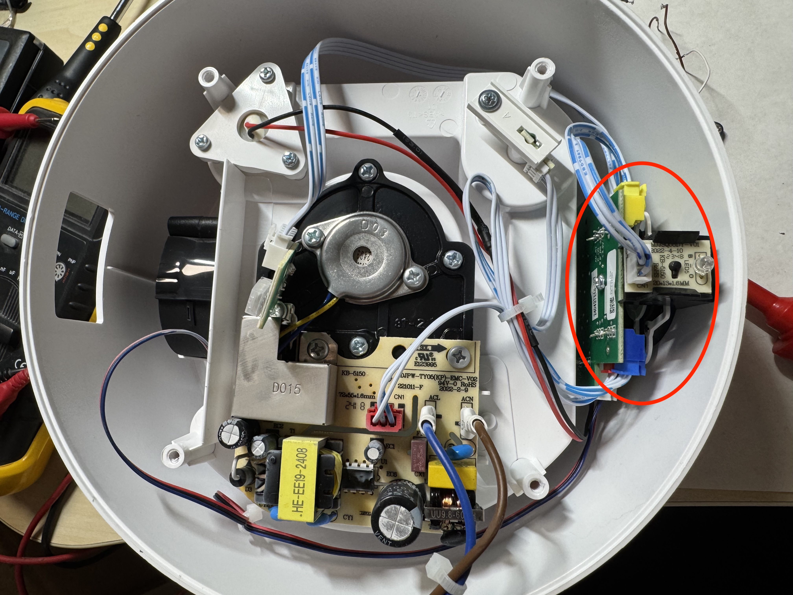

# Flashing ESPHome Firmware on Xiaomi Mi Smart Humidifier 2 (MJJSQ05DY)

This guide describes how to flash [ESPHome](https://esphome.io/) firmware onto the Xiaomi **Mi Smart Humidifier 2** (model `MJJSQ05DY`).
The model has a proprietary Xiaomi wifi module `MHCWB4P-B`.

---

### Acknowledgements
Special thanks to the people and repositories that made this possible:  
- [@plplaaa2](https://github.com/plplaaa2) for his [comments](https://github.com/libretiny-eu/libretiny/issues/44#issuecomment-2543502966) and providing a starting point.  
- [@prokoma](https://github.com/prokoma) for his research and his fork of libretiny ([link 1](https://github.com/prokoma/libretiny#55aacc8), [link 2](https://github.com/libretiny-eu/libretiny/issues/44#issuecomment-2514974466)).  
- [@Pwedge](https://github.com/Pwedge) for suggesting the [board type](https://github.com/esphome/issues/issues/6909#issuecomment-3037309282).  
- And of course, the teams behind [LibreTiny](https://github.com/libretiny-eu/libretiny) and [ESPHome](https://github.com/esphome/esphome).  

---

## Flashing Steps

### 1. Accessing the Board
1. Remove the rubber pads from the bottom of the humidifier.  
   

2. Remove the essential oil container and carefully remove the bottom part (don’t pull hard — cables are attached).  
   

3. Unscrew the essential oil container holder.  
   

4. Unscrew the black cable holder. Remove the power cable and the hydrometer (you may need to scrape off some hot glue). Then you can remove the bottom panel.

5. Locate the main board. Press the buttons from the outside to release it, then disconnect all connectors.  
   

6. Locate the Wi-Fi module and solder wires to the necessary pins. (Highlighted in the picture below in Comic Sans font).  
   

---

### 2. Wiring the Serial Adapter

| Chip Pin | Serial Adapter Connection     |
|----------|-------------------------------|
| VDD      | 3.3V                          |
| GPIO0    | 3.3V (for download mode)      |
| GND      | GND                           |
| GPIO16   | RX                            |
| GPIO15   | TX                            |

> On power-up, the module should enter **download mode**.  
> If it doesn’t, briefly connect the **Chip Enable pin** to **GND** to reset the module.

---

### 3. Flashing the Firmware

Follow the instructions from [this comment](https://github.com/libretiny-eu/libretiny/issues/44#issuecomment-2514974466):

1. **Install `ltchiptool`** (using [prokoma’s fork](https://github.com/prokoma/ltchiptool)):  
   ```bash
   python3 -m venv venv
   . venv/bin/activate
   pip install git+https://github.com/prokoma/ltchiptool.git@ambz2-fix
   ltchiptool -V
   ```

2. **Backup the stock firmware**:

   ```bash
   ltchiptool flash read -c realtek-ambz2 path/to/store/original_firmware.bin
   ```

3. **Compile ESPHome config** (`humidifier.yaml` from this repo):

   ```bash
   esphome compile humidifier.yaml
   ```

4. **Flash the ESPHome firmware** (⚠️ must use the modified `ltchiptool`, otherwise you’ll get a hash error at boot):

   ```bash
   ltchiptool flash write .esphome/build/smart-humidifier-2/.pioenvs/smart-humidifier-2/firmware.uf2
   ```

5. The device should now boot up running ESPHome. 🎉

---

### 4. Future OTA Updates

Once flashed, you can update firmware via OTA using:

```bash
esphome upload/run
```

---

## Notes

* The provided configuration (`humidifier.yaml`) is just a **starting point**. I am not an expert in ESPHome, so expect to tweak things as needed.
* Feel free to open issues and pull requests.
